# Ejercicio 1: Despliegue del tema "Minima" de Jekyll en GitHub Pages

En este documento, se describen los pasos para instalar y configurar el tema "Minima" de Jekyll inicialmente en un servidor local y posteriormente desplegarlo en GitHub Pages.

---

## Pasos para el despliegue local

### 1. Instalar Jekyll
1. **Instalar Ruby y Bundler:**
   - Descarga e instala Ruby desde [ruby-lang.org](https://www.ruby-lang.org/).
   - Ejecuta el siguiente comando para instalar Bundler:
     ```bash
     gem install bundler
     ```
     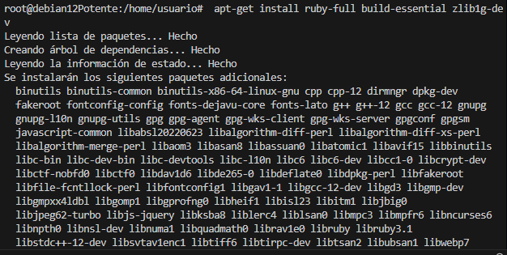

2. **Instalar Jekyll:**
   - Instala Jekyll utilizando Bundler:
     ```bash
     gem install jekyll
     ```
    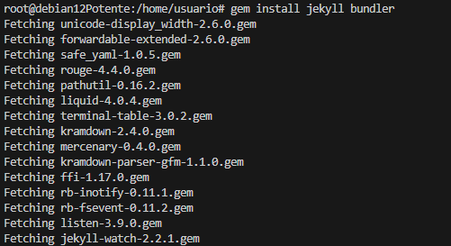

3. **Verificar instalación:**
   - Asegúrate de que Jekyll está instalado correctamente:
     ```bash
     jekyll -v
     ```

### 2. Crear un nuevo sitio en Jekyll
1. Crea un nuevo proyecto con el tema "Minima":
   ```bash
   jekyll new myblog --minimal
   ```

   Para ello creamos un Repositorio nuevo, además de un nuevo repositorio para iniciar un nuevo Jekyll.

   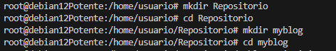
   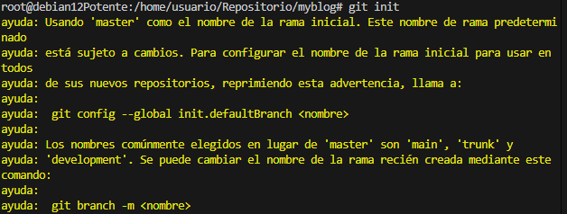

   Iniciamos el nuevo sitio de jekyll.
   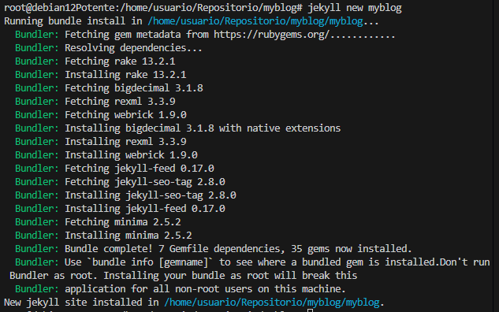

   Una vez con el sitio Jekyll creado debemos modificar algunos de los fichero que pertenecenal tema minima. Además de añadir tres post nuevos.

   Fichero _config.yml
   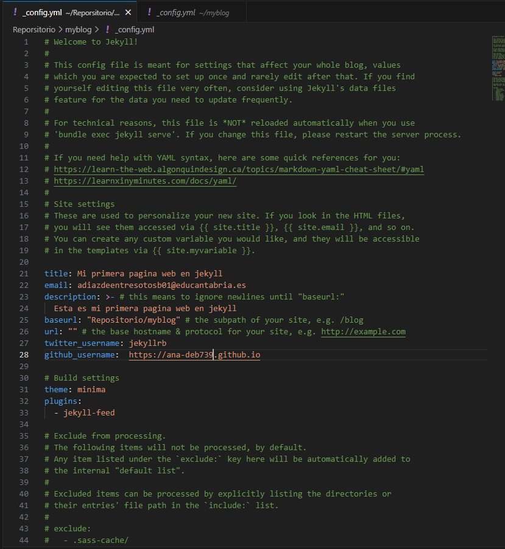

   Fichero about.md

   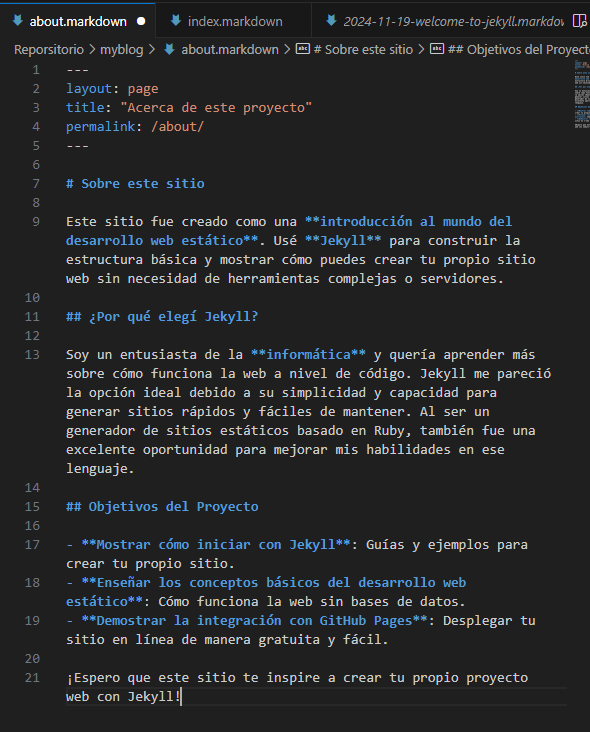

   Fichero index.md

   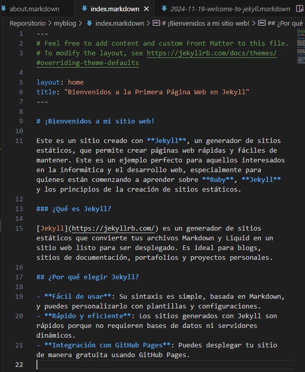


   Ahora creamos 3 post.

   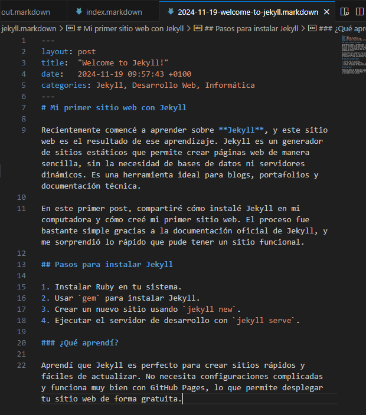

   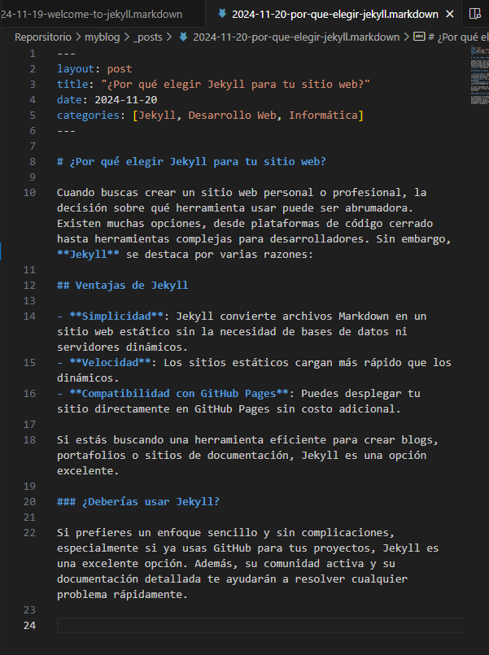

   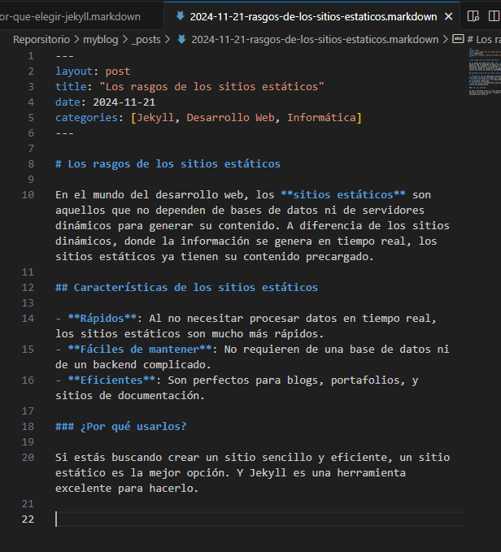

   Al finalizar lo subimos al repositorio de la rama gh-pages

   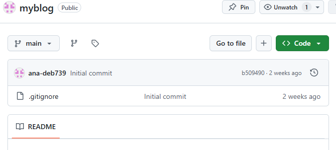